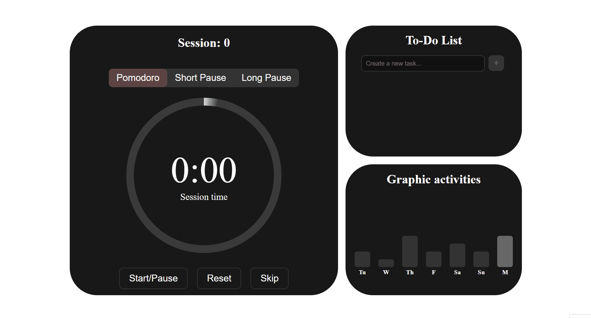
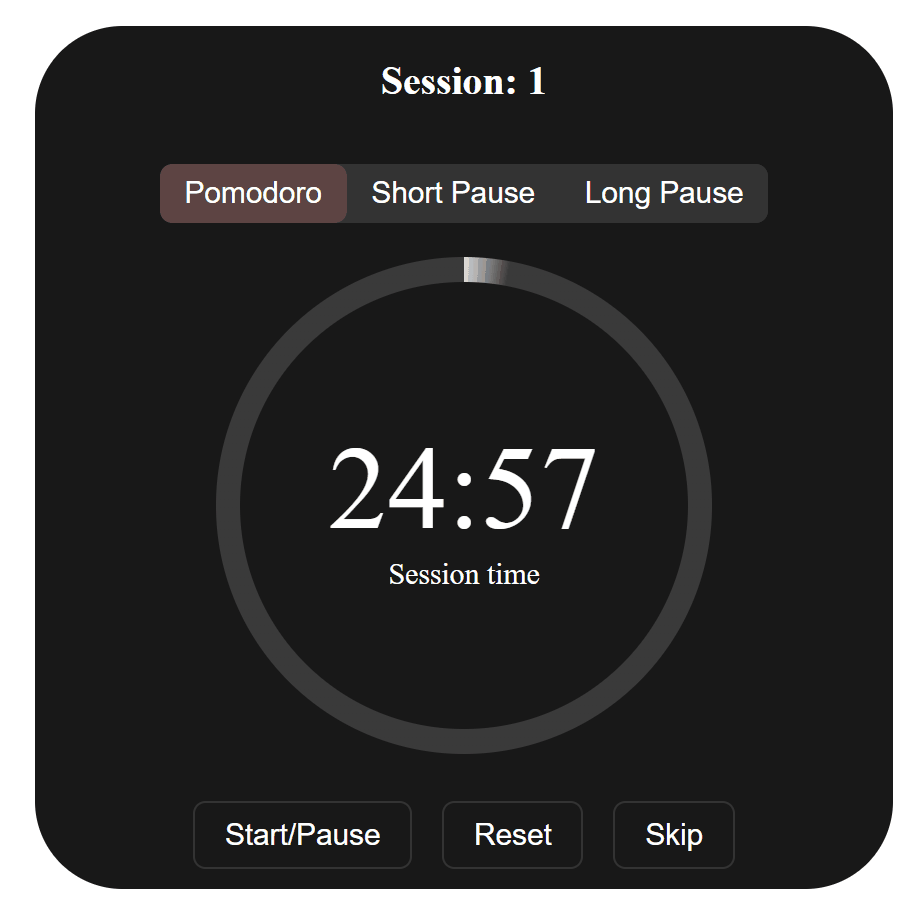
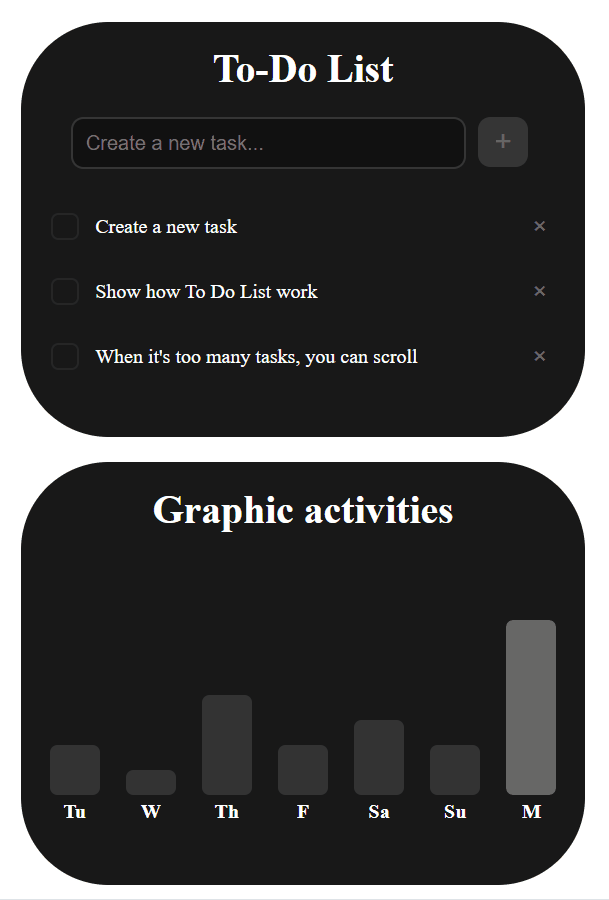
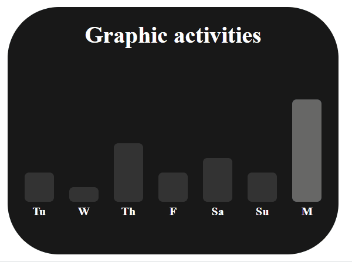
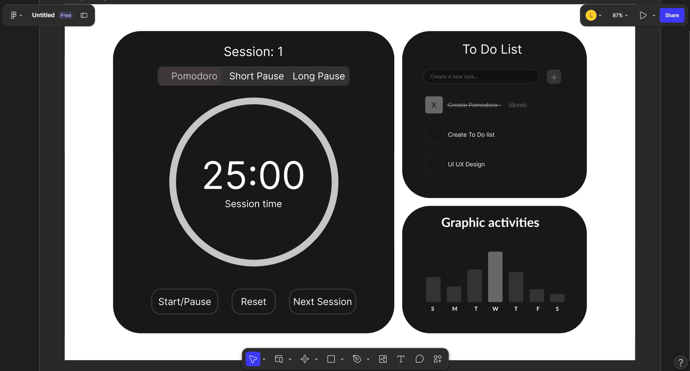

# Pomodoro Timer

A Pomodoro timer that runs in the browser, with a to-do list and a chart of the last seven days. The server is written in Free Pascal, the page is plain HTML, CSS and JavaScript.



## Features

- Three timer modes: Pomodoro (25 min), Short Pause (5 min) and Long Pause (15 min)
- Automatic cycle: a Long Pause after every third completed Pomodoro
- Start/Pause, Reset and Skip buttons
- A circle that fills as time passes
- A to-do list where you can add, complete and delete tasks
- An activity chart with completed sessions for the last seven days, saved to `graphic.json` so the history stays after a restart
- Focus mode: click the "To-Do List" header to expand the list to full height

## Preview

### Timer

<p align="center">
  
</p>

You can:

- switch between Pomodoro, Short Pause and Long Pause with the tabs at the top
- start and pause the countdown, or reset it to the beginning of the current mode
- skip to the end of the current session
- follow the progress in the circle and see which session you are on

### To-do list

<p align="center">
  
</p>

You can:

- type a task and add it with the plus button
- tick a task off, and it gets crossed out
- delete a task with the cross next to it
- click the "To-Do List" header to expand the panel over the chart, and click again to go back

### Activity chart

<p align="center">
  
</p>

You can:

- see how many Pomodoro sessions you finished on each of the last seven days
- find today quickly, because its bar is highlighted
- come back the next day and still see your history

## Getting started

Requirements:

- [Free Pascal Compiler](https://www.freepascal.org/) 3.x
- Windows, because the app uses `ShellAPI` to open the browser automatically

```bash
git clone https://github.com/HebiHause/pomodoro-ausbildung.git
cd pomodoro-ausbildung
fpc Pomodoro.pas
Pomodoro.exe
```

The browser opens at `http://localhost:8080`. Run the program from the project folder, because `index.html` and `style.css` are loaded from the working directory.

## Design

I designed the interface myself in Figma before writing the CSS. The layout is built on a 12-column grid with two rows. The timer takes columns 2 to 7 and both rows. The to-do list and the chart sit on the right in columns 8 to 11, one above the other. The two outer columns stay empty and work as margins.

<p align="center">
  
</p>

The same frame in Figma with the layout grid switched on and off.

The grid carries over to the code directly: `style.css` uses CSS Grid with the same 12 columns, and each panel is placed with `grid-column` and `grid-row`. Font sizes, gaps and padding use `clamp()`, so the layout scales with the window.

Figma file: [link](https://www.figma.com/site/IcGV08GciLLLxZaq9iT8lh/Untitled?node-id=0-1&t=iC5xD0yywx2XjUzv-1)

## How it works

The program does two things at once. The main thread runs the timer: once per second it lowers the remaining time and switches to the next mode when it reaches zero. A second thread runs the HTTP server. Both work with the same variables (remaining time, mode, session count, task list).

The page has no timer of its own. About once per second it asks the server for the time, the mode, the session count and the progress, and redraws them. That is why reloading the page resets nothing: the countdown keeps running on the server.

The buttons only send requests. The server changes its state, and the page shows the result on its next update. Skip, for example, sets the remaining time to zero, so the program moves on as if the time had run out.

The to-do list is an array of records (id, text, done) kept in memory. The page sends JSON to add, complete or delete a task, and each task keeps its own id, so deleting one does not affect the others. The session history works differently: after every finished Pomodoro the server adds 1 to today's date in `graphic.json`, and the file is read again at startup.

## Tech stack

| Layer    | Technology                                                |
|----------|-----------------------------------------------------------|
| Backend  | Free Pascal, `fphttpapp`, `httproute`, `fpjson`            |
| Frontend | HTML5, CSS3 (Grid, Flexbox, `conic-gradient`), vanilla JS |
| Storage  | JSON file (`graphic.json`)                                |

## API

| Route | Description |
|-------|-------------|
| `/`, `/style.css` | Serve the page and the styles |
| `/timer-status` | Remaining time as `mm:ss` |
| `/mode-status` | Current mode: 0 Pomodoro, 1 Short Pause, 2 Long Pause |
| `/session-request` | Number of completed sessions |
| `/progress-conic-gradient` | Progress of the current session in percent |
| `/set-pomodoro`, `/set-short-pause`, `/set-long-pause` | Change the mode |
| `/start-pause`, `/reset`, `/skip` | Control the timer |
| `/tasks` | All tasks as JSON |
| `/add-task`, `/task-done`, `/delete-task` | Change the list (POST with a JSON body) |
| `/graphic` | Sessions for the last seven days as JSON |

## Project structure

```
Pomodoro.pas      entry point: routes, timer loop, session logging
procedures.pas    request handlers and to-do list logic
index.html        page structure and frontend logic
style.css         styling
graphic.json      session history, created automatically
assets/           GIFs used in this README
```

## What this project covers

- Records and dynamic arrays (the task list)
- HTTP routing with `fphttpapp` and `httproute`
- Reading and writing JSON with `fpjson`
- Saving data to a file and loading it back
- A background thread for the server next to the main timer loop
- A frontend that talks to the backend with `fetch`

## Known limitations

- The to-do list is not saved to disk and is empty after a restart.
- Skip during a Pomodoro counts the session as completed.
- The page polls the server instead of receiving updates from it.
- Windows only.

## Next steps

- Add a task by pressing Enter, not only with the plus button
- Save the to-do list to a JSON file, the same way as the history

